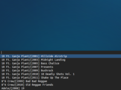

If you prefer keyboard over mouse like I do, you'll probably want a keyboard way of selecting music to be played./////

We can use `dmenu` to go through our Music collection and make a auto-complete suggestion list to select Music from.

[](images/2014-01-02-fast-clementine-music-selection-via-dmenu_1.png)
[](images/2014-01-02-fast-clementine-music-selection-via-dmenu_2.png)

We'll need to have some packages installed:

```perl
sudo apt-get install dmenu clementine xbindkeys
```

Save the following script (I named it `clementine_play_folder.sh`) and `chmod +x` it:

```bash
#!/bin/bash
flag=$1

function handleSelection {
  if [[ $1 ]]; then
    folder=$1
    if [ $flag == 'append' ]; then
      msg="Appended songs"
    else
      msg="Loaded songs"
    fi
    
    notify-send -i clementine "$msg" "$folder"
    if [ $flag == 'load' ]; then clementine --stop; fi
    clementine --$flag "/home/$( whoami )/Music/$folder"
    if [ $flag == 'load' ]; then clementine --play; fi

  fi
  exit 0
}

# If clementine's not running, start it!
if ! pgrep -x clementine >/dev/null; then
  clementine &
fi

handleSelection "$( cd /home/$( whoami )/Music; ls -d */* | dmenu_custom )"

exit 0
```

Be sure to replace and or edit the Music path at the bottom of the script if you  don't have a standard Music folder structure. Otherwise, it should work out of the box. The usage is quite simple, pass either `append` - to append the folder to the current playlist or `load` (which is default) - to replace the current playlist - option:

```perl
clementine_play_folder.sh load
```

or

```perl
clementine_play_folder.sh append
```

To set a global keyboard shortcut, I used `xbindkeys`. Relevant part of my `.xbindkeysrc`:

```
"~/scripts/clementine_play_folder.sh load"
  Mod4 + m

"~/scripts/clementine_play_folder.sh append"
  Mod4 + Shift + m
```

That's all folks, enjoy :)
